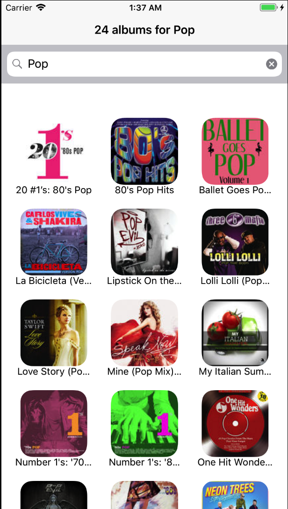
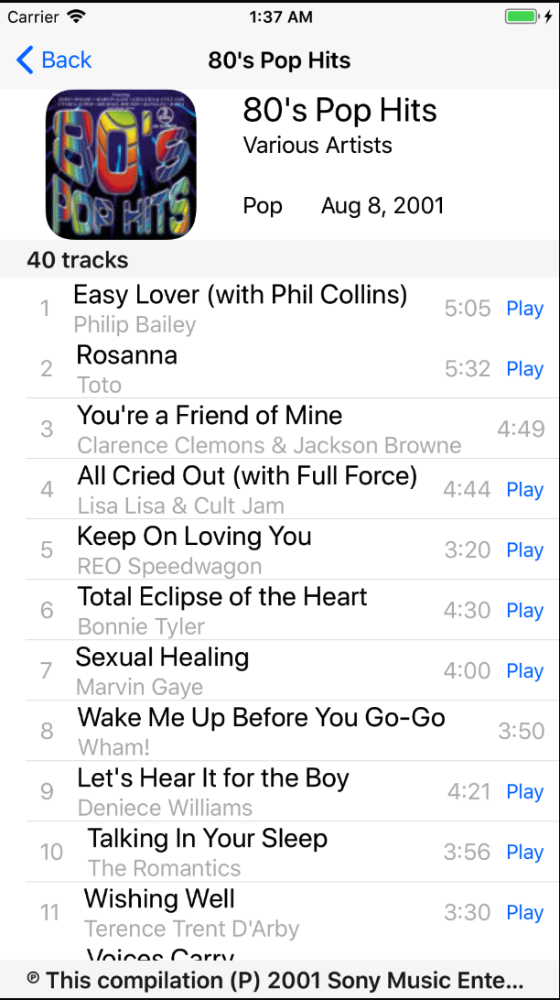
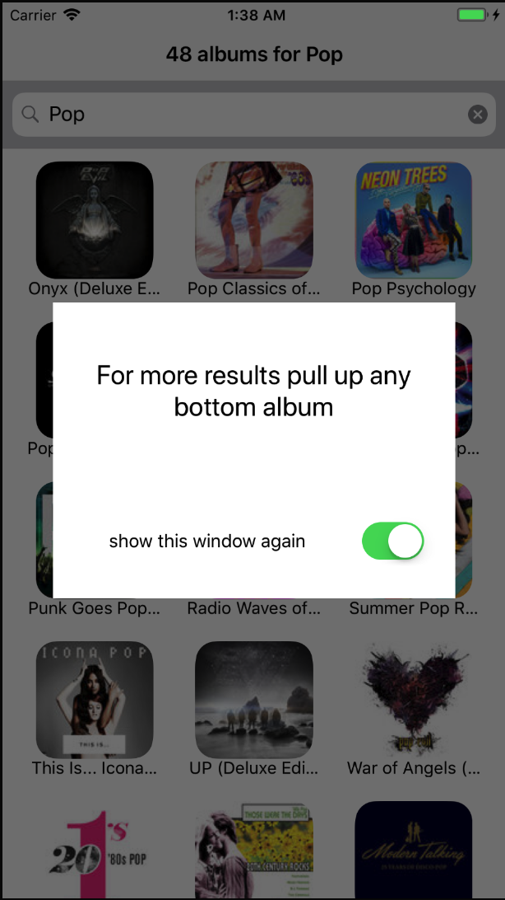

# pet-projects
iTunesArtworkSearcher - simple application for the iPhone. The application
 displays album artwork from the iTunes API, and the user can see detailed
information about the selected album. (MVC, Alamofire)

